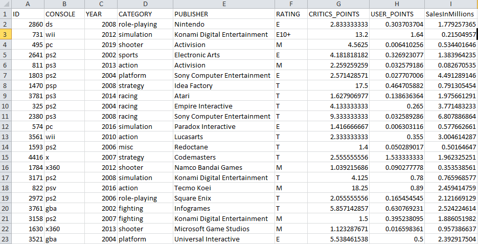
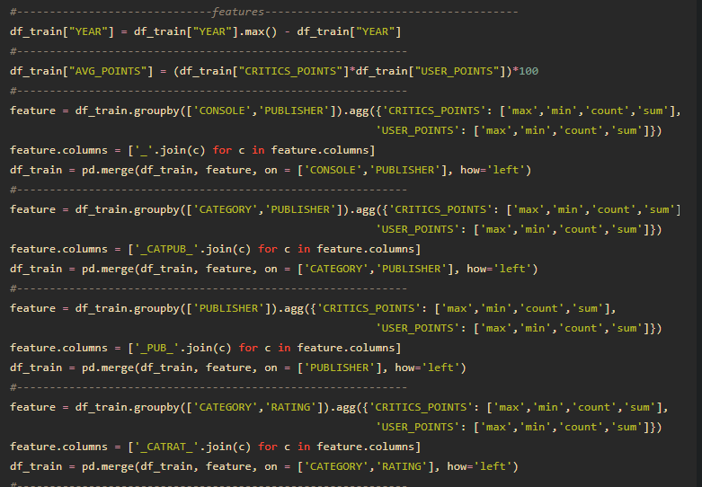

# Video-Game-Sales-Prediction-Weekend-Hackathon
**Solution for Machine Hack Weekend Hackathon #10** \
The gaming industry is certainly one of the thriving industries of the modern age and one of those that are most influenced by the advancement in technology. With the availability of technologies like AR/VR in consumer products like gaming consoles and even smartphones, the gaming sector shows great potential. In this hackathon, you as a data scientist must use your analytical skills to predict the sales of video games depending on given factors. Given are 8 distinguishing factors that can influence the sales of a video game. Your objective as a data scientist is to build a machine learning model that can accurately predict the sales in millions of units for a given game.

## Data at a Glance

     
## Feature Engineering

# A Description of my Methodology
#### Feature Engineering & Approach
1. Added New Features as shown above. 
2. User Points and Critics Points seems to be the best features of all, So made feature like mean max count min of them with respect to the categorical features.
3. Used CatBoostRegressor and LGBMRegressor for modeling and ensemble.
#### Tools used
1. Python for programming
2. sklearn and numpy libraries for methodology
3. catboost and lightgbm library for the model
4. matplotlib and seaborn was used for plotting and analyzing the data
#### Competition Result
Rank: 11th on public LB and __ on private LB\
[Link](https://www.machinehack.com/hackathons/5ef5dcfff86bc10bcd96d915)
